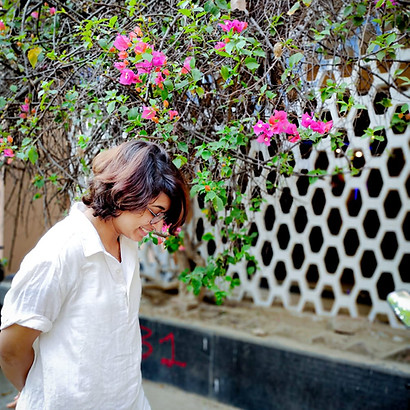

    

        
            
        
    

    

        <h2>Roopkatha Dam</h2>
        <h3>Senior Copywriter | Filmmaker | Creative Strategist</h3>
        
        
<strong>Creative Strategist | Ads, Ideas & Mild Existential Crises</strong>

        
        
I think, rethink and overthink ideas until they become award-worthy (or at least scroll-stopping). Whether it's a snappy tagline, a full-blown campaign, or a strategy to make a brand unforgettable, I love turning briefs into stories people actually want to watch.

        
        
Not much to write, but I've got the thinking cap on 24/7, turning ideas into something worth talking about, and I can wordsmith with the best of them. Teamwork? Love it. Strategy? Even better. And yes, I make a mean pun when needed.

    

### Professional Experience

**Senior Copywriter** | **Dentsu Network - iProspect** *(July 2024 - Present)*
Currently working with prominent brands such as **Reliance Retail** and **Fossil India**, handling multiple pitches and contributing to a range of creative projects. Actively involved in everyday creative tasks and the development of overall brand strategies and campaigns, spanning social media, offline, and integrated platforms.

**Copywriter** | **Promotedge** *(May 2023 - July 2024)*
Worked with a diverse range of clients, including **Veedol**, **SAI**, **MAGIK**, **TATA**, **BIRLA**, **SANY**, and **SONY MUSIC**, managing social media campaigns, calendars, and various other projects. Contributed to the development and execution of impactful strategies across multiple platforms.

**Creative Associate** | **SVF** *(September 2022 - January 2023)*
From ideation to execution, I've been deeply involved in major web series projects, handling all aspects of creative development. This role has been a valuable learning experience, allowing me to ideate, write, and hone my skills in a dynamic environment.

**Creative Trainee** | **Hoichoi** *(September 2021 - September 2022)*
Assisted in ideating and developing web series concepts, contributing to script structure, character arcs, and storytelling. Collaborated with writers and directors to refine narratives and ensure creative coherence. Provided feedback on scripts, researched trends for content relevance, and pitched engaging ideas.

### Education

**Master of Arts in Film Studies** | **Jadavpur University** *(2021-2023)*
Advanced studies in film theory, criticism, and production techniques.

**Bachelor of Science in Media Science** | **NSHM Knowledge Campus** *(2018-2021)*
Comprehensive foundation in media studies, communication, and digital content creation.

**ISC and ICSE** | **Loreto Convent Entally & Loreto Day School Bowbazar** *(2009-2018)*
Strong academic foundation with focus on humanities and creative subjects.

### Languages & Skills

**Languages:** English, Bengali, Hindi

**Core Competencies:**
- Creative Strategy & Campaign Development
- Brand Storytelling & Content Creation
- Social Media Strategy & Management
- Script Writing & Film Production
- Cross-Platform Campaign Integration
- Client Relationship Management

### Get In Touch

**Phone**: 8902271191 / 8240215159  
**Email**: roopkathaforever@gmail.com  
**Location**: Kolkata, West Bengal, India  
**LinkedIn**: [Roopkatha Dam](https://www.linkedin.com/in/roopkatha-dam-b25824154/)

Ready to collaborate on your next creative project? Let's connect and create something amazing together. 