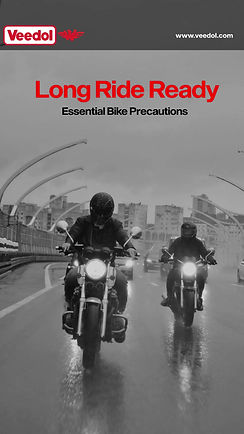

## CREATIVE SERVICES & EXPERTISE

Welcome to my creative universe where words meet visuals and ideas transform into compelling narratives that drive results.

### Featured Work Samples

    

        

            
                
            
            <h3>Content Strategy & Brand Storytelling</h3>
            
Comprehensive content development and strategic storytelling solutions that build brand connections and drive engagement across multiple touchpoints.

        

    

    

        

            
                
            
            <h3>Film Production & Visual Storytelling</h3>
            
Cinematic storytelling and visual content creation that captures audiences' attention and amplifies brand messages through compelling narratives.

        

    

### Pitch Highlights: The Ideas That Won

This is where strategy meets creative spark. Here's a look at the thinking behind some of the campaigns that made clients say "YES."

    

        

            <h4>Aditya Birla Health Insurance</h4>
            
<strong>The Ask:</strong> [To be filled in by you]

            
<strong>The Spark:</strong> [To be filled in by you]

            
<strong>The Big Idea:</strong> [To be filled in by you]

            
<strong>Why It Won:</strong> A blend of deep consumer insight and a creative platform that made health insurance feel empowering, not intimidating.

        

    

    

        

            <h4>Emami (Kesh King, Boroplus, 7 Oils in 1)</h4>
            
<strong>The Ask:</strong> [To be filled in by you]

            
<strong>The Spark:</strong> [To be filled in by you]

            
<strong>The Big Idea:</strong> [To be filled in by you]

            
<strong>Why It Won:</strong> Successfully repositioned legacy brands for a modern, digital-first audience without losing their core essence.

        

    

    

        

            <h4>Oberoi and Trident</h4>
            
<strong>The Ask:</strong> [To be filled in by you]

            
<strong>The Spark:</strong> [To be filled in by you]

            
<strong>The Big Idea:</strong> [To be filled in by you]

            
<strong>Why It Won:</strong> Captured the essence of luxury hospitality through a narrative that focused on unparalleled guest experiences over amenities.

        

    

    

        

            <h4>Godrej Properties</h4>
            
<strong>The Ask:</strong> [To be filled in by you]

            
<strong>The Spark:</strong> [To be filled in by you]

            
<strong>The Big Idea:</strong> [To be filled in by you]

            
<strong>Why It Won:</strong> Shifted the conversation from real estate to lifestyle, creating an emotional connection with potential homebuyers.

        

    

### Core Services

    

        <h4>📝 Content Strategy & Writing</h4>
        <ul>
            <li>Brand voice development</li>
            <li>Content strategy planning</li>
            <li>Creative copywriting</li>
            <li>Editorial content creation</li>
            <li>Social media storytelling</li>
        </ul>
    

    

        <h4>🎬 Film & Video Production</h4>
        <ul>
            <li>Documentary production</li>
            <li>Brand film creation</li>
            <li>Video content strategy</li>
            <li>Scriptwriting & direction</li>
            <li>Post-production coordination</li>
        </ul>
    

    

        <h4>🎨 Visual Storytelling</h4>
        <ul>
            <li>Creative concept development</li>
            <li>Visual content planning</li>
            <li>Multimedia storytelling</li>
            <li>Brand visual identity</li>
            <li>Campaign ideation</li>
        </ul>
    

    

        <h4>💡 Strategic Consultation</h4>
        <ul>
            <li>Brand communication audit</li>
            <li>Creative strategy development</li>
            <li>Content optimization</li>
            <li>Campaign planning</li>
            <li>Creative troubleshooting</li>
        </ul>
    

### My Creative Process

Every project follows a proven methodology that ensures exceptional results:

    

        

            <h3 style="color: #6fc3df;">1</h3>
            <h4>Discovery & Research</h4>
            
Deep dive into your brand, audience, objectives, and competitive landscape

        

    

    

        

            <h3 style="color: #8cc9f0;">2</h3>
            <h4>Strategy & Ideation</h4>
            
Develop creative concepts and strategic frameworks tailored to your goals

        

    

    

        

            <h3 style="color: #8a89c0;">3</h3>
            <h4>Creation & Production</h4>
            
Bring ideas to life through words, visuals, and compelling storytelling

        

    

    

        

            <h3 style="color: #cda2ab;">4</h3>
            <h4>Refinement & Delivery</h4>
            
Polish content to perfection and deliver exceptional results on time

        

    

### Why Choose My Creative Services?

**Strategic Creative Thinking**
I don't just create content—I develop strategic narratives that align with your business objectives and resonate with your target audience.

**Multi-Platform Expertise**
From written content to video production, I work across mediums to ensure consistent storytelling that amplifies your message.

**Results-Driven Approach**
Every creative decision is made with your goals in mind, whether that's increasing engagement, building brand awareness, or driving conversions.

**Collaborative Partnership**
I work as an extension of your team, bringing creative expertise while understanding your business needs and constraints.

### Industry Applications

My services adapt to various industries and business needs:

- **Entertainment & Media** → Audience engagement, content strategy
- **Technology & Startups** → Product storytelling, brand positioning  
- **Corporate & B2B** → Internal communications, thought leadership
- **Healthcare & Education** → Complex information simplification
- **E-commerce & Retail** → Brand storytelling, customer engagement

### Ready to Elevate Your Brand Story?

Every brand has a unique story waiting to be told. Let's work together to find yours and share it with the world in the most compelling way possible.

<ul class="actions">
    <li><a href="zcontact.html" class="button next">Start Your Project</a></li>
    <li><a href="clients.html" class="button">See Client Success Stories</a></li>
</ul>
