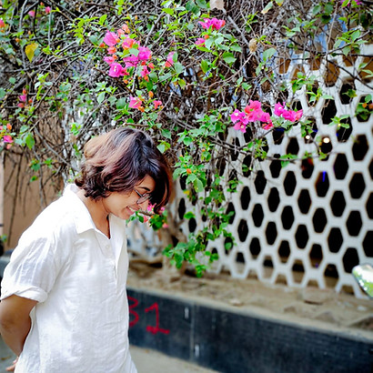
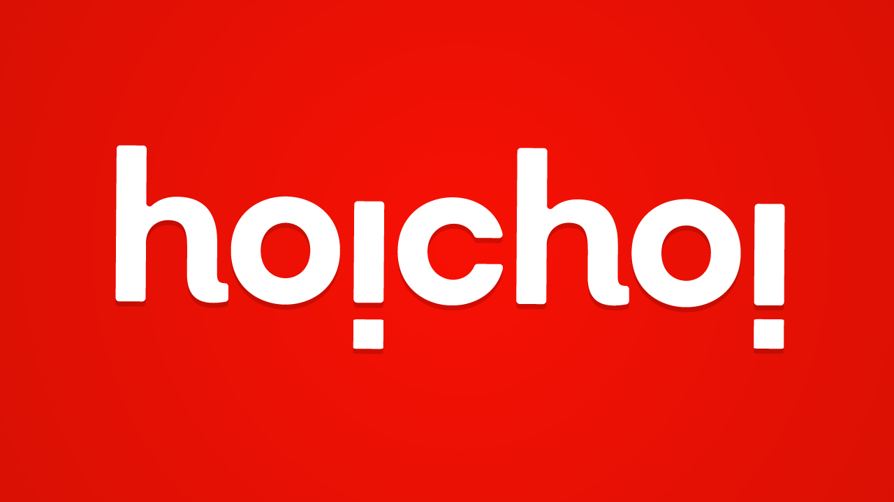

    

        
            
        
    

    

        <h2>Word Wizard | Idea Genie | Visual Virtuoso</h2>
        
        
<strong>Hey!</strong>

        
        
This is all about I.ME.MYSELF

        
        
I'm the <strong>word wizard, idea genie and visual virtuoso!</strong> I'm the go-to person for helping others spin their tales. I firmly believe in the magic of words—you know, the kind that can squeeze all your wildest dreams and deepest emotions into just a handful of lines. But that's not all! I'm also a part-time filmmaker with an unquenchable thirst for storytelling adventures.

        
        
Welcome to my portfolio playground, where I show off my wizardry as both a wordsmith and a cinematic sorcerer. So, click those buttons up there to dive into my world of resumes and projects. It's a fun ride, promise!

        
        <ul class="actions">
            <li><a href="about.html" class="button next">Learn More About Me</a></li>
            <li><a href="clients.html" class="button">View My Work</a></li>
        </ul>
    

## Recent Client Work

    

        

            
            
Content strategy and creative writing for India's leading OTT platform

        

    

    

        

            
            
Brand storytelling and visual content for leading entertainment company

        

    

    

        

            
            
Corporate communications and strategic content development

        

    

